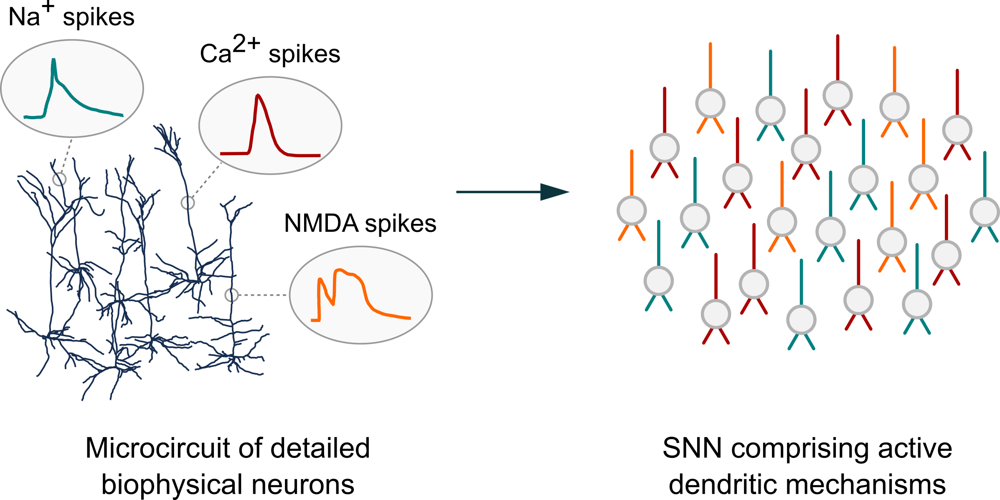

Dendrify
========

*Introducing dendrites to spiking neural networks*

.. image:: https://img.shields.io/pypi/v/Dendrify.svg
        :target: https://pypi.python.org/pypi/Dendrify

.. image:: https://readthedocs.org/projects/dendrify/badge/?version=latest
  :target: https://dendrify.readthedocs.io/en/stable/?badge=stable
  :alt: Documentation Status

.. image:: https://img.shields.io/badge/Contributor%20Covenant-v1.4%20adopted-ff69b4.svg
        :target: CODE_OF_CONDUCT.md
        :alt: Contributor Covenant

Although neuronal dendrites greatly influence how single neurons process incoming information, their role in network-level functions remain largely unexplored. Current SNNs are usually quite simplistic, overlooking essential dendritic properties. Conversely, circuit models with morphologically detailed neuron models are computationally costly, thus impractical for large-network simulations.

To bridge the gap between these two, we introduce Dendrify, a free, open-source Python package compatible with the `Brian 2 simulator <https://brian2.readthedocs.io/en/stable/>`_. Dendrify, through simple commands, automatically generates reduced compartmental neuron models with simplified yet biologically relevant dendritic and synaptic integrative properties. Such models strike a good balance between flexibility, performance, and biological accuracy, allowing us to explore dendritic contributions to network-level functions.

If you use Dendrify for your published research, we kindly ask you to cite our article:

Pagkalos, M., Chavlis, S., & Poirazi, P. (2023). Introducing the Dendrify framework for incorporating dendrites to spiking neural networks. Nature Communications, 14(1), 131. https://doi.org/10.1038/s41467-022-35747-8

Documentation for Dendrify can be found at https://dendrify.readthedocs.io/en/latest/

The project presentation for the INCF/OCNS Software Working Group is available `on google drive <https://docs.google.com/presentation/d/1LUUh2ja3YSHcmByU0Vyn7vcDEnDq6fWfVxFfuK8FzE0/edit?usp=sharing>`_ and an interactive notebook with a short demo `on google colab <https://colab.research.google.com/drive/1-bGp15eWfjNuF7ETCNSsL3ovOanS_R_7?usp=sharing>`_.
