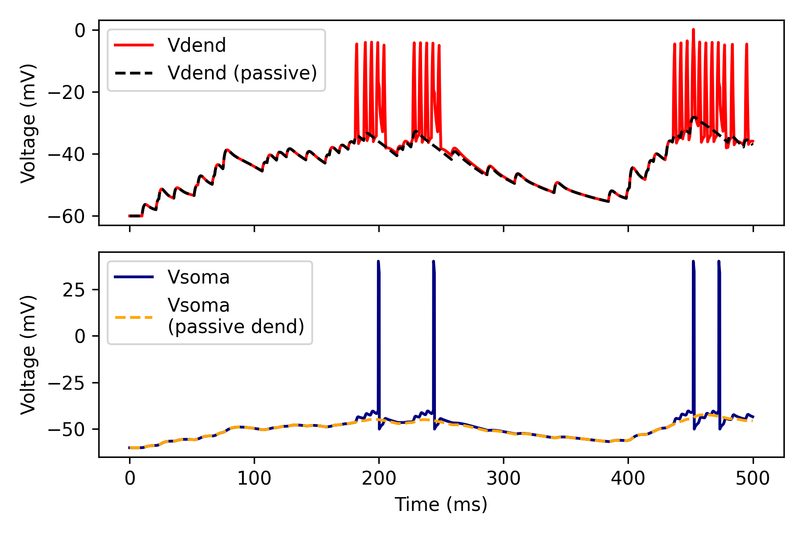

Active vs passive dendrites
===========================

This examples shows:

- How to create a compartmental model with active or passive dendrites.

.. code-block:: python

    import brian2 as b
    from brian2.units import Hz, cm, ms, mV, nS, ohm, pA, pF, uF, um, uS
    
    from dendrify import Dendrite, NeuronModel, Soma
    
    b.prefs.codegen.target = 'numpy'
    
    # create soma
    b.seed(123)
    soma = Soma('soma', cm_abs=200*pF, gl_abs=10*nS)
    
    # create dendrite
    dend = Dendrite('dend', cm_abs=50*pF, gl_abs=2.5*nS)
    dend.synapse('AMPA', tag='x', g=3*nS,  t_decay=2*ms)
    dend.synapse('NMDA', tag='x', g=3*nS,  t_decay=60*ms)
    dend.dspikes('Na', g_rise=30*nS, g_fall=14*nS)
    
    # make model
    model = NeuronModel([(soma, dend, 15*nS)], v_rest=-60*mV)
    model.config_dspikes('Na', threshold=-35*mV,
                         duration_rise=1.2*ms, duration_fall=2.4*ms,
                         offset_fall=0.2*ms, refractory=5*ms,
                         reversal_rise='E_Na', reversal_fall='E_K')
    
    # make neuron group
    neuron, ap_reset = model.make_neurongroup(1, method='euler', threshold='V_soma > -40*mV',
                                    reset='V_soma = 40*mV',
                                    second_reset='V_soma=-50*mV',
                                    spike_width=0.8*ms,
                                    refractory=4*ms)
    
    # input
    Input = b.PoissonGroup(5, rates=20*Hz)
    
    # synapse
    S = b.Synapses(Input, neuron, on_pre='s_AMPA_x_dend += 1; s_NMDA_x_dend += 1')
    S.connect(p=1)
    
    # record
    vars = ['V_soma', 'V_dend']
    M = b.StateMonitor(neuron, vars, record=True)
    
    # run
    b.run(500*ms)
    
    # visualize
    time = M.t/ms
    v1 = M.V_soma[0]/mV
    v2 = M.V_dend[0]/mV
    
    fig, ax = b.subplots(figsize=(7, 4))
    ax.plot(time, v1, label='soma')
    ax.plot(time, v2, label='dend')
    ax.set_xlabel('Time (ms)')
    ax.set_ylabel('Voltage (mV)')
    ax.legend(loc='best')
    fig.tight_layout()
    b.show()

