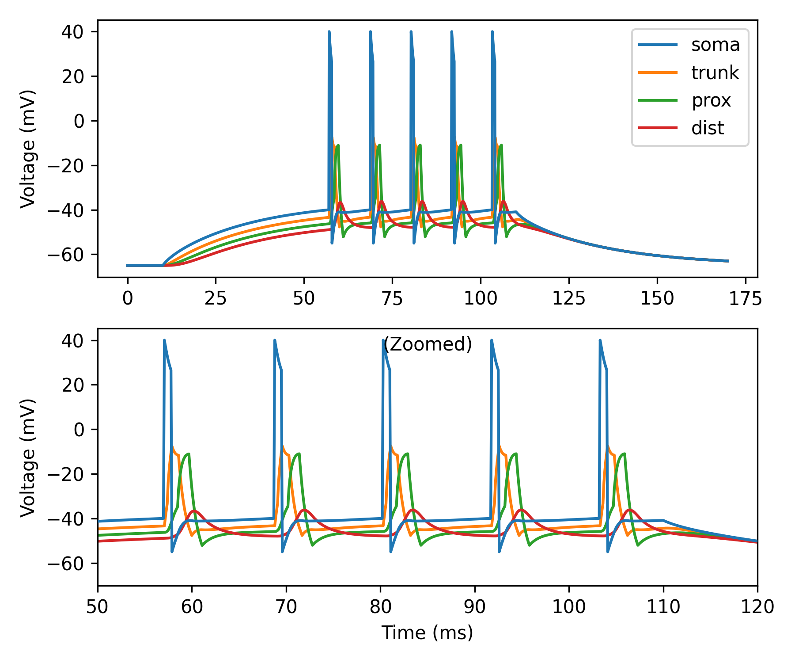

Back-propagating dSpikes
========================

An important property of biological neurons is that action potentials (APs)
initiated in the axon can invade the soma and nearby dendrites and propagate
backwards toward the dendritic tips. The transmission efficacy of these
back-propagating action potentials (bAPs) relies on the dendritic morphology
and the presence of dendritic voltage-gated ion channels.

In Dendrify, to achieve this behavior one needs to first recreate a more
realistic somatic AP shape by using the ``second_reset`` and ``spike_width``
arguments in ``make_neurongroup``. In this way, the somatic voltage can be first
reset to a more positive value and then below threshold. This allows the passive
depolarization of proximal dendrites in responses to somatic APs. If dendrites
are also equipped with active ionic mechanisms, this depolarization can trigger
the spontaneous generation of dendritic bAPs.

In this example we show:

- How to implement back-propagating dSpikes in Dendrify.
- How to achieve a more realistic somatic AP shape in I&F models, that is
  essential for the generation of bAPs.

.. important::

   Notice that when a ``second_reset`` is used, the ``make_neurongroup`` method
   returns an additional object which is Brian's Synapses. If your simulation
   code uses :doc:`Brian's Networks <brian2:user/running>` feature, this
   additional object should be added to the network as well (also shown in the 
   example below).

.. code-block:: python

    import brian2 as b
    from brian2.units import cm, ms, mV, nS, ohm, pA, uF, um, uS
    
    from dendrify import Dendrite, NeuronModel, Soma
    
    b.prefs.codegen.target = 'numpy' # faster for simple simulations
    
    # Create neuron model
    soma = Soma('soma', model='leakyIF', length=25*um, diameter=25*um)
    trunk = Dendrite('trunk', length=100*um, diameter=2.5*um)
    prox = Dendrite('prox', length=100*um, diameter=1*um)
    dist = Dendrite('dist', length=100*um, diameter=0.5*um)
    
    trunk.dspikes('Na', g_rise=22*nS, g_fall=14*nS)
    prox.dspikes('Na', g_rise=9*nS, g_fall=5.7*nS)
    dist.dspikes('Na', g_rise=3.7*nS, g_fall=2.4*nS)
    
    con = [(soma, trunk, 15*nS), (trunk, prox, 6*nS), (prox, dist, 2*nS)]
    model = NeuronModel(con, cm=1*uF/(cm**2), gl=40*uS/(cm**2),
                        v_rest=-65*mV, r_axial=150*ohm*cm,
                        scale_factor=2.8, spine_factor=1.5)
    model.config_dspikes('Na', threshold=-35*mV,
                         duration_rise=1.2*ms, duration_fall=2.4*ms,
                         offset_fall=0.2*ms, refractory=5*ms,
                         reversal_rise='E_Na', reversal_fall='E_K')
    
    # Make a new neurongroup
    neuron, ap_reset = model.make_neurongroup(1, method='euler',
                                              threshold='V_soma > -40*mV',
                                              reset='V_soma = 40*mV',
                                              second_reset= 'V_soma=-55*mV',
                                              spike_width = 0.8*ms,
                                              refractory=4*ms)
    
    # Record voltages
    vars = ['V_soma', 'V_trunk', 'V_prox', 'V_dist']
    M = b.StateMonitor(neuron, vars, record=True)
    
    # Run simulation
    net = b.Network(neuron, ap_reset, M)
    net.run(10*ms)
    neuron.I_ext_soma = 150*pA
    net.run(100*ms)
    neuron.I_ext_soma = 0*pA
    net.run(60*ms)
    
    # Visualize results
    fig, axes = b.subplots(2, 1, figsize=(6, 5))
    ax0, ax1 = axes
    
    ax0.plot(M.t/ms, M.V_soma[0]/mV, label='soma', zorder=3)
    ax0.plot(M.t/ms, M.V_trunk[0]/mV, label='trunk')
    ax0.plot(M.t/ms, M.V_prox[0]/mV, label='prox')
    ax0.plot(M.t/ms, M.V_dist[0]/mV, label='dist')
    ax0.set_ylabel('Voltage (mV)')
    ax0.legend()
    
    ax1.plot(M.t/ms, M.V_soma[0]/mV, zorder=3)
    ax1.plot(M.t/ms, M.V_trunk[0]/mV)
    ax1.plot(M.t/ms, M.V_prox[0]/mV)
    ax1.plot(M.t/ms, M.V_dist[0]/mV)
    ax1.set_title('(Zoomed)', y=1, pad=-12, fontsize=10)
    ax1.set_xlabel('Time (ms)')
    ax1.set_ylabel('Voltage (mV)')
    ax1.set_xlim(50, 120)
    
    fig.tight_layout()
    b.show()

