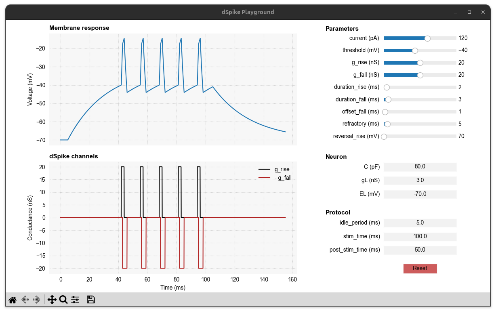

dSpike Playground
=================

A key feature of Dendrify is its ability to efficiently and flexibly model
dendritic spiking. With just a few straightforward parameters, you can recreate
dendritic spikes (dSpikes) of arbitrary shapes and properties. For further
details, see the relevant :meth:`documentation <.Dendrite.dspikes>`
and :ref:`examples <compartmental>`.

The following example demonstrates how to launch the dSpike Playground,
a simple graphical tool for visualizing and understanding dendritic spikes
in Dendrify. For more information on how to use or customize it, please
refer to the :class:`Playground documentation <.Playground>`.

.. code-block:: python

    from brian2 import prefs
    from brian2.units import *
    from dendrify import Playground

    prefs.codegen.target = 'cython' # slow first simulation but faster later on

    # Create a Playground object
    pg = Playground()
    pg.run() # timeit=True lets you print the simulation time

