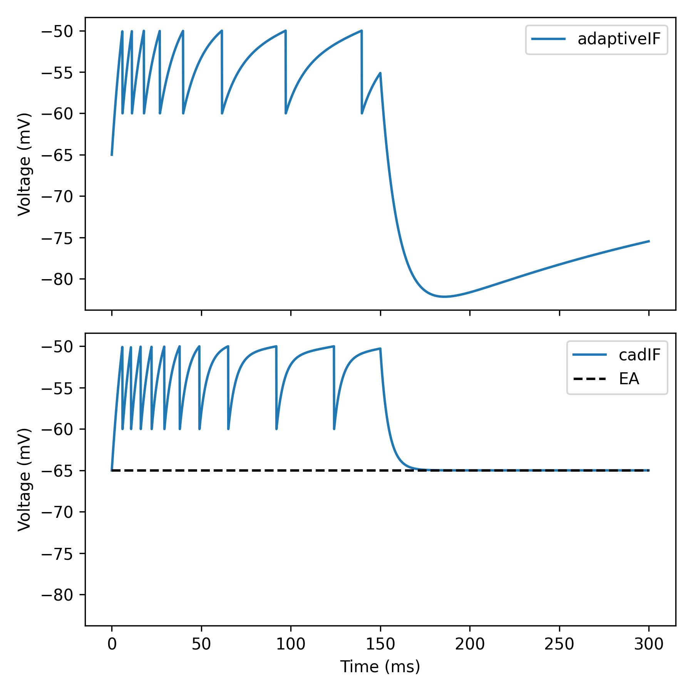

Other adaptive models
=====================

Apart from the Adaptive Exponential integrate-and-fire model (AdEx), Dendrify
also supports other types of adaptive models, that can be preferred in some
cases. In this example, we compare the behavior of two different adaptive models:

- The Adaptive IF model with current-based adaptation (adaptiveIF), which is
  simpler and faster to simulate than AdEx.

- The Conductance-based adaptive IF model (cadIF), which provides a solution
  to a common problem of current-based models, namely the excessive membrane 
  hyperpolarization that can occur after high-frequency firing.

.. code-block:: python

    import brian2 as b
    from brian2.units import Hz, ms, mV, nA, nS, pA, pF
    
    from dendrify import PointNeuronModel
    
    b.prefs.codegen.target = 'numpy'  # faster for simple simulations
    
    # A point neuron model with current-based adaptation
    adaptiveIF = PointNeuronModel(
        model='adaptiveIF',
        cm_abs=150*pF,
        gl_abs=15*nS,
        v_rest=-65*mV)
    
    adaptiveIF.add_params(
        {'Vth': -50*mV,
         'tauw': 210*ms,
         'a': 0*nS,     # no subthreshold adaptation for simplicity
         'b': 60*pA,
         'Vr': -60*mV})
    
    adaptiveIF_neuron = adaptiveIF.make_neurongroup(
        N=1,
        threshold='V>Vth',
        reset='V=Vr; w+=b',
        method='euler')
    
    # A point neuron model with conductance-based adaptation
    cadIF = PointNeuronModel(
        model='cadIF',
        cm_abs=150*pF,
        gl_abs=15*nS,
        v_rest=-65*mV)
    
    cadIF.add_params(
        {'Vth': -50*mV,
         'tauA': 210*ms,
         'gAmax': 0*nS,     # no subthreshold adaptation for simplicity
         'delta_gA': 3*nS,
         'Vr': -60*mV,
         'EA': -65*mV})
    
    cadIF_neuron = cadIF.make_neurongroup(
        N=1,
        threshold='V>Vth',
        reset='V=Vr; gA+=delta_gA',
        method='euler')
    
    # Record voltages
    adaptiveIF_trace = b.StateMonitor(adaptiveIF_neuron, ['V'], record=0)
    cadIF_trace = b.StateMonitor(cadIF_neuron, ['V'], record=0)
    
    # Run simulation
    adaptiveIF_neuron.I_ext = 500*pA
    cadIF_neuron.I_ext = 500*pA
    b.run(150 * ms)
    adaptiveIF_neuron.I_ext = 0*pA
    cadIF_neuron.I_ext = 0*pA
    b.run(150 * ms)
    
    # Plot results
    fig, axes = b.subplots(2, 1, figsize=[6, 6], sharex=True, sharey=True)
    ax1, ax2 = axes
    ax1.plot(adaptiveIF_trace.t / ms,
             adaptiveIF_trace[0].V / mV,
             label='adaptiveIF')
    ax1.set_ylabel('Voltage (mV)')
    ax1.legend()
    
    ax2.plot(cadIF_trace.t / ms,
             cadIF_trace[0].V / mV,
             label='cadIF')
    ax2.hlines(-65, 0, 300, 'k', '--', label='EA')
    ax2.set_xlabel('Time (ms)')
    ax2.set_ylabel('Voltage (mV)')
    ax2.legend()
    fig.tight_layout()
    b.show()

