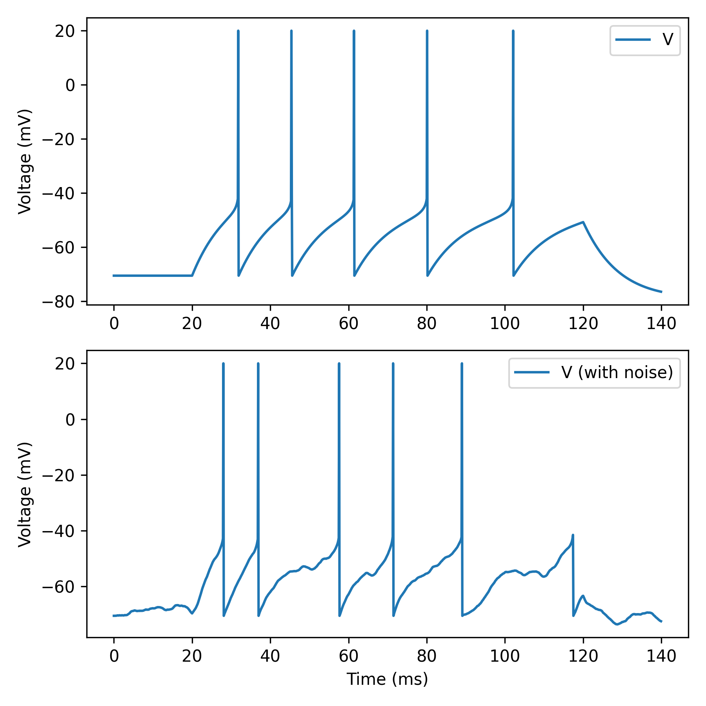

AdEx neuron + noise
===================

The Dendrify implementation of the Adaptive exponential integrate-and-fire model
(adapted from `Brian's examples <https://brian2.readthedocs.io/en/stable/examples/frompapers.Brette_Gerstner_2005.html>`_).

In this example, we also explore:

- How to add gaussian noise.
- How to create NeuronGroups with different properties using a single PointNeuronModel.

Resources:

- http://www.scholarpedia.org/article/Adaptive_exponential_integrate-and-fire_model
- https://pubmed.ncbi.nlm.nih.gov/16014787/

.. code-block:: python

    
    import brian2 as b
    from brian2.units import ms, mV, nA, nS, pA, pF
    
    from dendrify import PointNeuronModel
    
    b.prefs.codegen.target = 'numpy'  # faster for simple simulations
    b.seed(1234)  # for reproducibility
    
    # Create neuron model
    model = PointNeuronModel(model='adex',
                             cm_abs=281*pF,
                             gl_abs=30*nS,
                             v_rest=-70.6*mV)
    
    model.add_params({'Vth': -50.4*mV,
                      'DeltaT': 2*mV,
                      'tauw': 144*ms,
                      'a': 4*nS,
                      'b': 0.0805*nA,
                      'Vr': -70.6*mV})
    
    # Create a NeuronGroup
    neuron = model.make_neurongroup(N=1, threshold='V>Vth+5*DeltaT',
                                    reset='V=Vr; w+=b',
                                    method='euler')
    
    # Update model with noise and create a new NeuronGroup
    model.noise(mean=50*pA, sigma=300*pA, tau=2*ms)
    noisy_neuron = model.make_neurongroup(N=1, threshold='V>Vth+5*DeltaT',
                                          reset='V=Vr; w+=b',
                                          method='euler')
    
    # Record voltages and spike times
    trace = b.StateMonitor(neuron, 'V', record=True)
    spikes = b.SpikeMonitor(neuron)
    noisy_trace = b.StateMonitor(noisy_neuron, 'V', record=True)
    noisy_spikes = b.SpikeMonitor(noisy_neuron)
    
    # Run simulation
    b.run(20 * ms)
    neuron.I_ext = 1*nA
    noisy_neuron.I_ext = 1*nA
    b.run(100 * ms)
    neuron.I_ext = 0*nA
    noisy_neuron.I_ext = 0*nA
    b.run(20 * ms)
    
    # Trick to draw nicer spikes in I&F models
    vm = trace[0].V[:]
    noisy_vm = noisy_trace[0].V[:]
    for t1, t2 in zip(spikes.t, noisy_spikes.t):
        i = int(t1 / b.defaultclock.dt)
        j = int(t2 / b.defaultclock.dt)
        vm[i] = 20*mV
        noisy_vm[j] = 20*mV
    
    # Plot results
    fig, axes = b.subplots(2, 1, figsize=[6, 6])
    ax1, ax2 = axes
    ax1.plot(trace.t / ms, vm / mV, label='V')
    ax1.set_ylabel('Voltage (mV)')
    ax1.legend()
    
    ax2.plot(noisy_trace.t / ms, noisy_vm / mV, label='V (with noise)')
    ax2.set_ylabel('Voltage (mV)')
    ax2.set_xlabel('Time (ms)')
    ax2.legend()
    fig.tight_layout()
    b.show()

