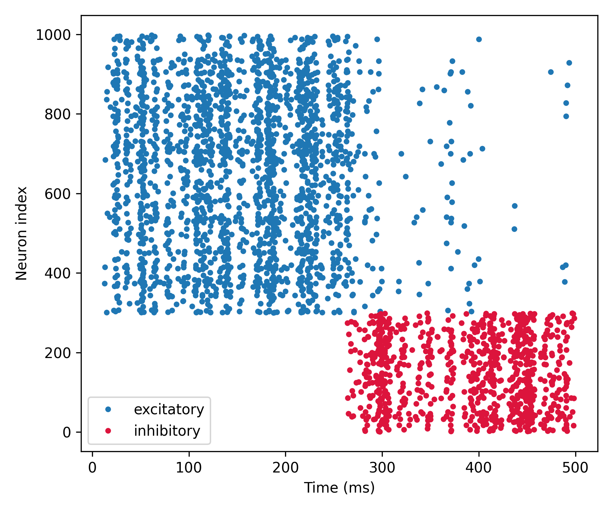

LIF network + inhibition
========================

In this example, we present a simple network of generic leaky integrate-and-fire
units comprising interconnected excitatory and inhibitory neurons.

In this example, we also explore:

- How to add different types of synaptic equations.
- How to achieve more complex network connectivity.

.. code-block:: python

    import brian2 as b
    from brian2.units import Hz, ms, mV, nS, pF
    
    from dendrify import PointNeuronModel
    
    b.prefs.codegen.target = 'numpy'  # faster for simple simulations
    b.seed(123)  # for reproducibility
    
    N_e = 700
    N_i = 300
    
    # Create a neuron model
    model = PointNeuronModel(model='leakyIF', cm_abs=281*pF, gl_abs=30*nS,
                             v_rest=-70.6*mV)
    
    # external excitatory input
    model.synapse('AMPA', tag='ext', g=2*nS, t_decay=2.5*ms)
    model.synapse('GABA', tag='inh', g=2*nS, t_decay=7.5*ms)  # feedback inhibition
    model.add_params({'Vth': -40.4*mV, 'Vr': -65.6*mV})
    
    # Create a NeuronGroup
    neurons = model.make_neurongroup(N=N_e+N_i, threshold='V>Vth',
                                     reset='V=Vr', method='euler')
    
    # Subpopulation of 300 inhibitory neurons
    inhibitory = neurons[:N_i]
    
    # Subpopulation of 700 excitatory neurons
    excitatory = neurons[N_i:]
    
    # Create a Poisson input
    Input = b.PoissonGroup(200, rates=90*Hz)
    
    # Specify synaptic connections
    Syn_ext_a = b.Synapses(Input, excitatory, on_pre='s_AMPA_ext += 1')
    Syn_ext_a.connect(p=0.2)
    
    Syn_ext_b = b.Synapses(Input, inhibitory, on_pre='s_AMPA_ext += 1')
    Syn_ext_b.connect(p=0)  # initially no connections to inhibitory neurons
    
    Syn_inh = b.Synapses(inhibitory, excitatory, on_pre='s_GABA_inh += 1')
    Syn_inh.connect(p=0.15)
    
    # Record voltages and spike times
    spikes_e = b.SpikeMonitor(excitatory)
    spikes_i = b.SpikeMonitor(inhibitory)
    
    # Run simulation
    b.run(250 * ms)
    Syn_ext_b.connect(p=0.2)  # add connections to inhibitory neurons
    b.run(250 * ms)
    
    # Plot results
    b.figure(figsize=[6, 5])
    b.plot(spikes_e.t/ms, spikes_e.i+N_i, '.', label='excitatory')
    b.plot(spikes_i.t/ms, spikes_i.i, '.', label='inhibitory', c='crimson')
    b.xlabel('Time (ms)')
    b.ylabel('Neuron index')
    b.legend()
    b.tight_layout()
    b.show()

