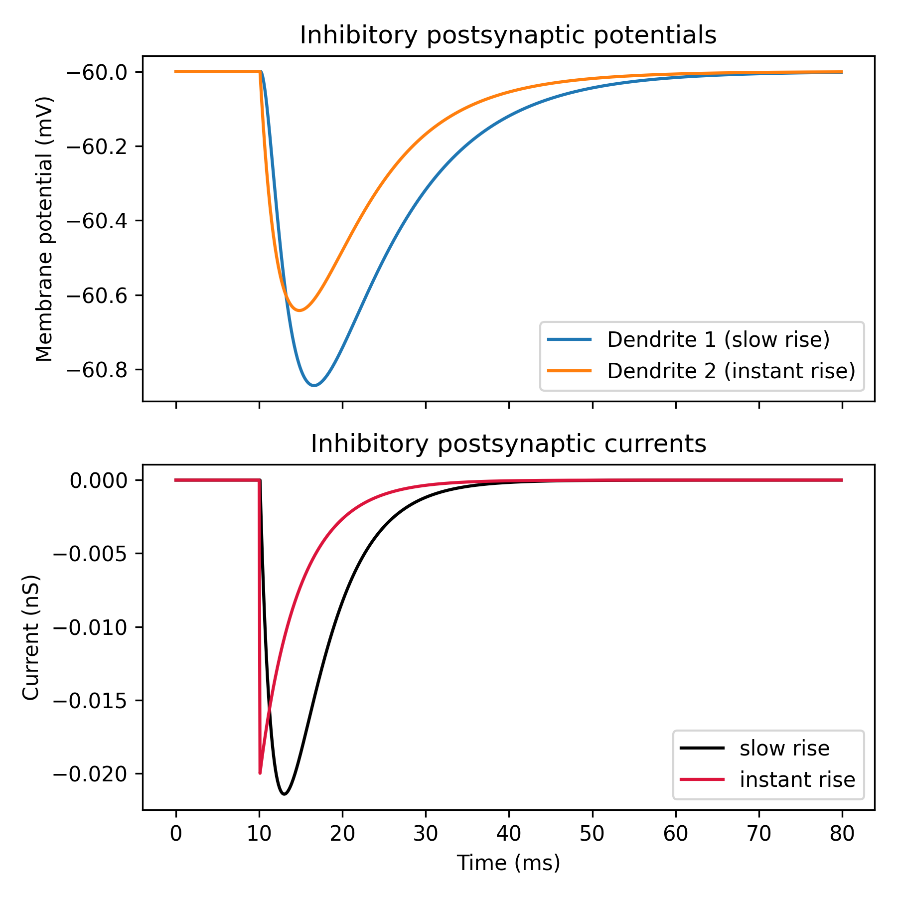

GABA synapses
=============

GABA receptors are the most common type of inhibitory ionotropic receptors in the
brain. They have fast kinetics and are responsible for inhibitory synaptic
transmission.

In this example we show:

- How to add and activate GABA synapses at various model compartments.
- How to adjust the synaptic conductance and kinetics of GABA synapses.

.. code-block:: python

    import brian2 as b
    from brian2.units import ms, mV, nS, pF
    
    from dendrify import Dendrite, NeuronModel, Soma
    
    b.prefs.codegen.target = 'numpy'  # faster for simple simulations
    
    # Create a simple 3-compartment neuron model
    soma = Soma('soma', cm_abs=100*pF, gl_abs=10*nS)
    dend1 = Dendrite('dend1', cm_abs=50*pF, gl_abs=5*nS)
    dend2 = Dendrite('dend2', cm_abs=50*pF, gl_abs=5*nS)
    
    # Add GABA synapse with rise and decay kinetics to dend1
    dend1.synapse('GABA', tag='slow', g=1*nS, t_rise=2*ms, t_decay=5*ms)
    
    # Add GABA synapse with instantaneous rise and decay kinetics to dend2
    dend2.synapse('GABA', tag='fast', g=1*nS,  t_decay=5*ms)
    
    # Merge the compartments into a single neuron model
    model = NeuronModel([(soma, dend1, 10*nS),
                         (dend1, dend2, 10*nS)],
                        v_rest=-60*mV)
    
    # Create 2 neurons (no somatic spiking for simplicity)
    neurons = model.make_neurongroup(2, method='euler')
    
    # Each neuron receives a spike at t=10ms at different dendrites
    input_spikes = b.SpikeGeneratorGroup(2, [0, 1], [10, 10]*ms)
    slow_gaba = b.Synapses(input_spikes, neurons, on_pre='s_GABA_slow_dend1 += 1')
    slow_gaba.connect(i=0, j=0)
    fast_gaba = b.Synapses(input_spikes, neurons, on_pre='s_GABA_fast_dend2 += 1')
    fast_gaba.connect(i=1, j=1)
    
    # Create monitors
    variables = ['V_dend1', 'V_dend2', 'I_GABA_slow_dend1', 'I_GABA_fast_dend2']
    M = b.StateMonitor(neurons, variables, record=True)
    
    # Run the simulation
    b.run(80*ms)
    
    # Visualize results
    time = M.t/ms
    vd1 = M.V_dend1[0]/mV
    vd2 = M.V_dend2[1]/mV
    ampa1 = M.I_GABA_slow_dend1[0]/nS
    ampa2 = M.I_GABA_fast_dend2[1]/nS
    
    fig, axes = b.subplots(2, 1, sharex=True, figsize=(6, 6))
    ax0, ax1 = axes
    
    ax0.set_title('Inhibitory postsynaptic potentials')
    ax0.plot(time, vd1, label='Dendrite 1 (slow rise)')
    ax0.plot(time, vd2, label='Dendrite 2 (instant rise)')
    ax0.set_ylabel('Membrane potential (mV)')
    ax0.legend()
    
    ax1.set_title('Inhibitory postsynaptic currents')
    ax1.plot(time, ampa1, c='black', label='slow rise')
    ax1.plot(time, ampa2, c='crimson', label='instant rise')
    ax1.set_xlabel('Time (ms)')
    ax1.set_ylabel('Current (nS)')
    ax1.legend()
    
    fig.tight_layout()
    b.show()

