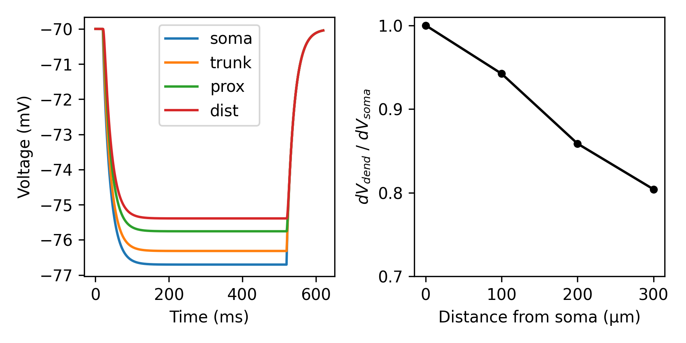

Dendritic attenuation
=====================

The attenuation of currents traveling along the somatodendritic axis is an
intrinsic property of biological neurons and is due to the morphology and cable
properties of their dendritic trees. (also see `Tran-van-Minh et al, 2015 
<https://www.frontiersin.org/articles/10.3389/fncel.2015.00067>`_).

In this example, we show:

- How tor 

.. code-block:: python

