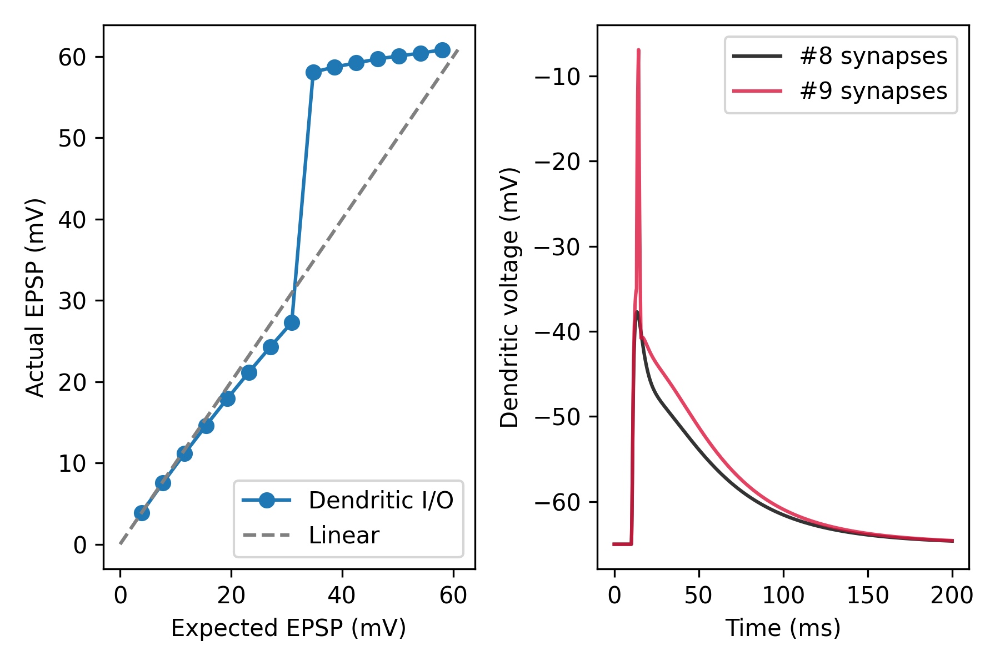

Dendritic I/O curve
===================

Dendritic integration can be quantified by comparing the observed depolarization
resulting from the simultaneous activation of the same synaptic inputs, also
called a compound EPSP, and the arithmetic sum of individual EPSPs (expected
membrane depolarization). The dendritic input-output (I/O) relationship is
easily described by plotting observed vs. expected depolarizations for different
numbers of co-activated synapses (also see `Tran-van-Minh et al, 2015 
<https://www.frontiersin.org/articles/10.3389/fncel.2015.00067>`_.

.. code-block:: python

