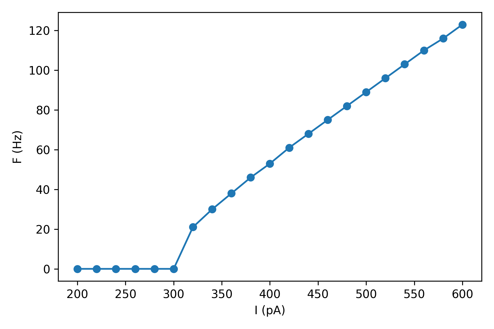

Frequency-current curve
=======================

A frequency-current curve (F-I curve) is the function that relates the net
current ``I`` flowing into a neuron to its firing rate ``F``.

In this example we show:

- How to calculate the somatic F-I curve for a simple 2-compartment neuron model.
- How to perform the above experiment in a vectorized and efficient manner.

.. code-block:: python

    import brian2 as b
    from brian2.units import ms, mV, nS, pA, pF
    
    from dendrify import Dendrite, NeuronModel, Soma
    
    b.prefs.codegen.target = 'numpy'  # faster for simple simulations
    
    # Create neuron model
    soma = Soma('soma', cm_abs=200*pF, gl_abs=10*nS)
    dend = Dendrite('dend', cm_abs=50*pF, gl_abs=2.5*nS)
    model = NeuronModel([(soma, dend, 15*nS)], v_rest=-65*mV)
    
    # Range of current amplitudes to test
    I = range(200, 620, 20) * pA
    
    # Create neuron group
    """Instead of creating a single neuron, we create a group of neurons, each with
    a different value of ``I_ext``. This allows us to calculate the F-I curve in a
    single simulation."""
    neurons = model.make_neurongroup(len(I), method='euler',
                                     threshold='V_soma > -40*mV',
                                     reset='V_soma = -55*mV',
                                     refractory=4*ms)
    
    # Record spike times
    spikes = b.SpikeMonitor(neurons)
    
    # Run simulation
    sim_time = 1000*ms
    neurons.I_ext_soma = I
    b.run(sim_time)
    
    # Visualize F-I curve
    F = [len(s) / sim_time for s in spikes.spike_trains().values()]
    b.figure(figsize=(6, 4))
    b.plot(I/pA, F, 'o-')
    b.xlabel('I (pA)')
    b.ylabel('F (Hz)')
    b.tight_layout()
    b.show()

