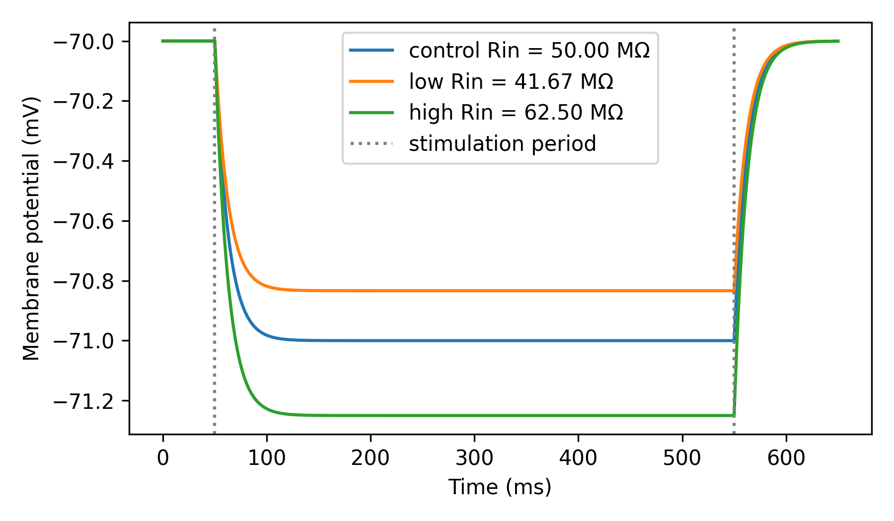

Input resistance
================

Input resistance (``Rin``) determines how much a neuron depolarizes in response
to a steady current. It is a useful metric of a neuron's excitability; neurons
with high ``Rin`` depolarize more in response to a given current than neurons
with low ``Rin``. ``Rin`` is often measured experimentally by injecting a small
current ``I`` into the neuron and measuring the steady-state change in its
membrane potential ``ΔV``. Using Ohm's law, ``Rin`` can be estimated as
``Rin = ΔV/I``.

In this example we show:

- How to calculate ``Rin`` in a point neuron model.
- How ``Rin`` is affected by changes in the neuron's membrane leak conductance
  ``gl``. 

Note: We also scale the neuron's membrane capacitance ``cm`` to maintain a
constant membrane time constant (``τm = cm/gl``).

.. code-block:: python

    import brian2 as b
    from brian2.units import Mohm, ms, mV, nS, pA, pF
    
    from dendrify import PointNeuronModel
    
    b.prefs.codegen.target = 'numpy'  # faster for simple simulations
    
    # Parameters
    g_leakage = 20*nS  # membrane leak conductance
    capacitance = 250*pF  # membrane capacitance
    EL = -70*mV  # resting potential
    
    # Create neuron models
    control = PointNeuronModel(model='leakyIF', cm_abs=capacitance,
                               gl_abs=g_leakage, v_rest=EL)
    
    low_rin = PointNeuronModel(model='leakyIF', cm_abs=capacitance*1.2,
                               gl_abs=g_leakage*1.2, v_rest=EL)
    
    high_rin = PointNeuronModel(model='leakyIF', cm_abs=capacitance*0.8,
                                gl_abs=g_leakage*0.8, v_rest=EL)
    
    # Create NeuronGroups (no threshold or reset conditions for simplicity)
    control_neuron = control.make_neurongroup(N=1, method='euler')
    low_rin_neuron = low_rin.make_neurongroup(N=1, method='euler')
    high_rin_neuron = high_rin.make_neurongroup(N=1, method='euler')
    
    # Record voltages
    control_monitor = b.StateMonitor(control_neuron, 'V', record=0)
    low_rin_monitor = b.StateMonitor(low_rin_neuron, 'V', record=0)
    high_rin_monitor = b.StateMonitor(high_rin_neuron, 'V', record=0)
    
    # Run simulation
    I = -20*pA  # current pulse amplitude
    b.run(50*ms)
    for n in [control_neuron, low_rin_neuron, high_rin_neuron]:
        n.I_ext = -20*pA
    b.run(500*ms)
    for n in [control_neuron, low_rin_neuron, high_rin_neuron]:
        n.I_ext = 0*pA
    b.run(100*ms)
    
    # Calculate Rin
    Rin_control = (min(control_monitor.V[0]) - control_monitor.V[0][500]) / I
    Rin_low = (min(low_rin_monitor.V[0]) - low_rin_monitor.V[0][500]) / I
    Rin_high = (min(high_rin_monitor.V[0]) - high_rin_monitor.V[0][500]) / I
    
    # Plot results
    b.figure(figsize=(6, 3.5))
    b.plot(control_monitor.t/ms, control_monitor.V[0]/mV,
           label='control Rin = {:.2f} MΩ'.format(Rin_control / Mohm))
    b.plot(low_rin_monitor.t/ms, low_rin_monitor.V[0]/mV,
           label='low Rin = {:.2f} MΩ'.format(Rin_low / Mohm))
    b.plot(high_rin_monitor.t/ms, high_rin_monitor.V[0]/mV,
           label='high Rin = {:.2f} MΩ'.format(Rin_high / Mohm))
    b.axvline(50, ls=':', c='gray', label='stimulation period')
    b.axvline(550, ls=':', c='gray')
    b.xlabel('Time (ms)')
    b.ylabel('Membrane potential (mV)')
    b.legend()
    b.tight_layout()
    b.show()

