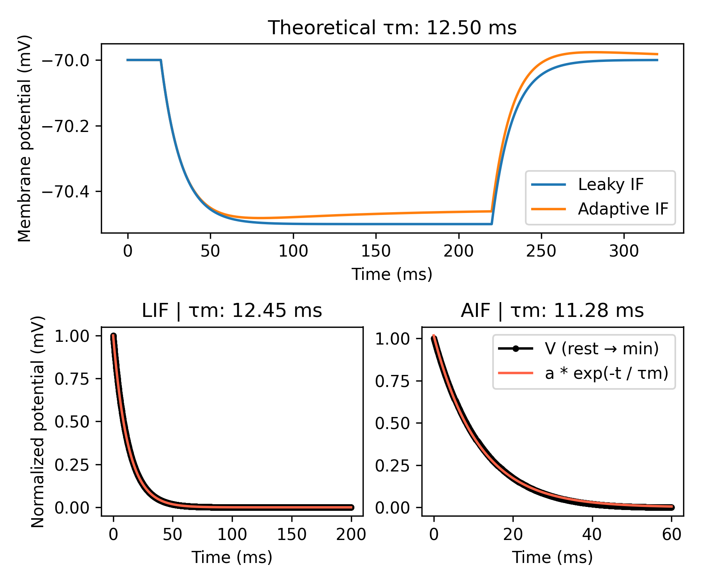

Membrane time constant
======================

In this example, we show how to calculate a neuron's membrane time constant
``τm``, a metric that describes how quickly the membrane potential ``V`` decays
to its steady-state value after some perturbation. In simple RC circuits, ``τm``
is calculated as the product of the membrane capacitance ``C`` and the membrane
resistance ``R``. However, in neurons, ``τm`` is also affected by voltage-gated
conductances or other non-linearities.

Experimentally, ``τm`` can be calculated as the time for the potential ``V`` to
fall from its resting  value to a fraction (1-l/e), or 63%, of its final value
during the application of a small negative current pulse. In other words, it is
the time constant of the exponential decay of the membrane potential in response
to a small hyperpolarizing current pulse.

Here we show how to calculate ``τm`` for a neuron model experimentally and how it
is affected by the presence of voltage-gated conductances, such as an adaptation
current.

.. code-block:: python

    import brian2 as b
    from brian2.units import ms, mV, nS, pA, pF
    from scipy.optimize import curve_fit
    
    from dendrify import PointNeuronModel
    
    b.prefs.codegen.target = 'numpy'  # faster for simple simulations
    
    # Create neuron models
    GL = 20*nS  # membrane leak conductance
    CM = 250*pF  # membrane capacitance
    EL = -70*mV  # resting potential
    tau_theory = CM / GL  # theoretical membrane time constant
    
    lif = PointNeuronModel(model='leakyIF', cm_abs=CM, gl_abs=GL, v_rest=EL)
    aif = PointNeuronModel(model='adaptiveIF', cm_abs=CM, gl_abs=GL, v_rest=EL)
    aif.add_params({'tauw': 100*ms, 'a': 2*nS})
    
    # Create NeuronGroups (no threshold or reset conditions for simplicity)
    lif_neuron = lif.make_neurongroup(N=1, method='euler')
    aif_neuron = aif.make_neurongroup(N=1, method='euler')
    
    # Record voltages
    lif_monitor = b.StateMonitor(lif_neuron, 'V', record=0)
    aif_monitor = b.StateMonitor(aif_neuron, 'V', record=0)
    
    # Run simulation
    I = -10*pA # current pulse amplitude
    t0 = 20*ms  # time to start current pulse
    t_stim = 200*ms  # duration of current pulse
    
    b.run(t0)
    lif_neuron.I_ext, aif_neuron.I_ext = I, I
    b.run(t_stim)
    lif_neuron.I_ext, aif_neuron.I_ext = 0*pA, 0*pA
    b.run(100*ms)
    
    # Analysis code
    def func(t, a, tau):
        """Exponential decay function"""
        return a * b.exp(-t / tau)
    
    def get_tau(trace, t0):
        dt = b.defaultclock.dt
        Vmin = min(trace)
        time_to_peak = list(trace).index(Vmin)
        # Find voltage from current-start to min value
        voltages = trace[int(t0/dt): time_to_peak] / mV
        # Min-max normalize voltages
        v_norm = (voltages - voltages.min()) / (voltages.max() - voltages.min())
        # Fit exp decay function to normalized data
        X = b.arange(0, len(v_norm)) * dt / ms
        popt, _ = curve_fit(func, X, v_norm)
        return popt, X, v_norm
    
    # Plot results
    popt_lif, X_lif, v_norm_lif = get_tau(lif_monitor.V[0], t0)
    popt_aif, X_aif, v_norm_aif = get_tau(aif_monitor.V[0], t0)
    
    fig, axes = b.subplot_mosaic("""
                                 AA
                                 BC
                                 """, layout='constrained', figsize=[6, 5])
    ax0, ax1, ax2 = axes.values()
    ax0.plot(lif_monitor.t/ms, lif_monitor.V[0]/mV, label='Leaky IF')
    ax0.plot(aif_monitor.t/ms, aif_monitor.V[0]/mV, label='Adaptive IF', zorder=0)
    ax0.set_title('Theoretical τm: {:.2f} ms'.format(tau_theory/ms))
    ax0.set_ylabel('Membrane potential (mV)')
    ax0.legend()
    ax1.plot(X_lif, v_norm_lif, 'ko-', ms=3)
    ax1.plot(X_lif, func(X_lif, *popt_lif), c='tomato')
    ax1.set_ylabel('Normalized potential (mV)')
    ax1.set_title(f'LIF | τm: {popt_lif[1]:.2f} ms')
    ax2.plot(X_aif, v_norm_aif, 'ko-', label='V (rest \u2192 min)', ms=3)
    ax2.plot(X_aif, func(X_aif, *popt_aif), label='a * exp(-t / τm)', c='tomato')
    ax2.set_title(f'AIF | τm: {popt_aif[1]:.2f} ms')
    ax2.legend()
    for ax in axes.values():
        ax.set_xlabel('Time (ms)')
    fig.tight_layout()
    b.show()

