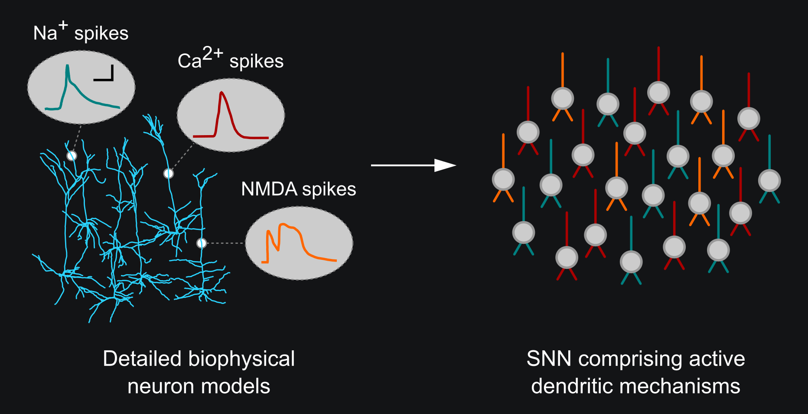

Introduction
============

.. image:: https://img.shields.io/pypi/v/Dendrify.svg
        :target: https://pypi.python.org/pypi/Dendrify

.. image:: https://readthedocs.org/projects/dendrify/badge/?version=latest
  :target: https://dendrify.readthedocs.io/en/stable/?badge=stable
  :alt: Documentation Status

.. image:: https://img.shields.io/badge/Contributor%20Covenant-v1.4%20adopted-ff69b4.svg
        :target: CODE_OF_CONDUCT.md
        :alt: Contributor Covenant

Although neuronal dendrites greatly influence how single neurons process incoming
information, their role in network-level functions remain largely unexplored.
Current SNNs are usually quite simplistic, overlooking essential dendritic
properties. Conversely, circuit models with morphologically detailed neuron
models are computationally costly, thus impractical for large-network
simulations.

To bridge the gap between these two, we introduce Dendrify, a free,
open-source Python package compatible with the
`Brian 2 simulator <https://brian2.readthedocs.io/en/stable/>`_. Dendrify,
through simple commands, automatically generates reduced compartmental neuron
models with simplified yet biologically relevant dendritic and synaptic
integrative properties. Such models strike a good balance between flexibility,
performance, and biological accuracy, allowing us to explore dendritic
contributions to network-level functions.

.. image:: _static/intro.png
   :width: 75 %
   :align: center
   :class: only-light

.. tip::
   If you use Dendrify for your published research, we kindly ask you to cite our
   article:|br|
   **Introducing the Dendrify framework for incorporating dendrites to spiking neural networks** |br|
   M Pagkalos, S Chavlis, P Poirazi |br|
   DOI: https://doi.org/10.1038/s41467-022-35747-8 |br|

|

**CONTENTS:**

.. toctree::
   :maxdepth: 2
   :caption: Getting started
   
   self
   installation

.. toctree::
   :maxdepth: 1
   :caption: Tutorials
   
   tutorials/Dendrify_101
   tutorials/Dendrify_simulations

.. toctree::
   :maxdepth: 1
   :caption: Examples
   
   examples/mechanisms
   examples/compartmental
   examples/point

.. toctree::
   :maxdepth: 2
   :caption: Reference documentation

   api/classes
   api/models
   genindex

.. toctree::
   :maxdepth: 1
   :caption: Useful information

   papers
   changelog
   code_of_conduct

.. |br| raw:: html

      
