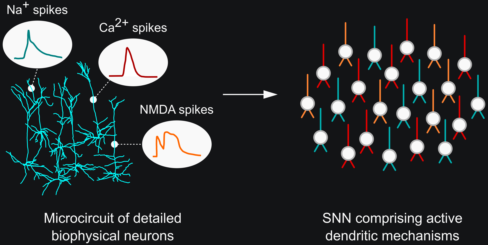

Introduction
============

.. image:: https://img.shields.io/pypi/v/Dendrify.svg
        :target: https://pypi.python.org/pypi/Dendrify

.. image:: https://readthedocs.org/projects/dendrify/badge/?version=latest
  :target: https://dendrify.readthedocs.io/en/stable/?badge=stable
  :alt: Documentation Status

.. image:: https://img.shields.io/badge/Contributor%20Covenant-v1.4%20adopted-ff69b4.svg
        :target: CODE_OF_CONDUCT.md
        :alt: Contributor Covenant

Neuronal dendrites play a crucial role in shaping how individual neurons process
synaptic information, yet their contributions to network-level functions remain
largely underexplored. While current spiking neural networks (SNNs) often
oversimplify or neglect essential dendritic properties, circuit models with
morphologically detailed neuron representations are computationally expensive,
limiting their practicality for large-scale network simulations.

To address these challenges, we introduce Dendrify, a free and open-source Python
package designed to work seamlessly with the :doc:`Brian 2 simulator <brian2:index>`.
Dendrify enables users to generate reduced compartmental neuron models with
biologically relevant dendritic and synaptic properties using simple commands.
These models strike a good balance between flexibility, performance, and accuracy,
making it possible to study the impact of dendrites on network-level functions.

.. image:: _static/intro.png
   :width: 75 %
   :align: center
   :class: only-light

.. tip::
   If you use Dendrify for your published research, we kindly ask you to cite our
   article:|br|
   **Introducing the Dendrify framework for incorporating dendrites to spiking neural networks** |br|
   M Pagkalos, S Chavlis, P Poirazi |br|
   DOI: https://doi.org/10.1038/s41467-022-35747-8 |br|

|

**CONTENTS:**

.. toctree::
   :maxdepth: 1
   :caption: Getting started
   
   self
   installation
   changelog

.. toctree::
   :maxdepth: 1
   :caption: Tutorials
   
   tutorials/Dendrify_101
   tutorials/Dendrify_simulations

.. toctree::
   :maxdepth: 1
   :caption: Examples
   
   examples/compartmental
   examples/point
   examples/synapses
   examples/validation

.. toctree::
   :maxdepth: 2
   :caption: Reference documentation

   api/classes
   api/models
   genindex

.. toctree::
   :maxdepth: 1
   :caption: Useful information

   support
   known_issues
   papers
   code_of_conduct

.. |br| raw:: html

      
