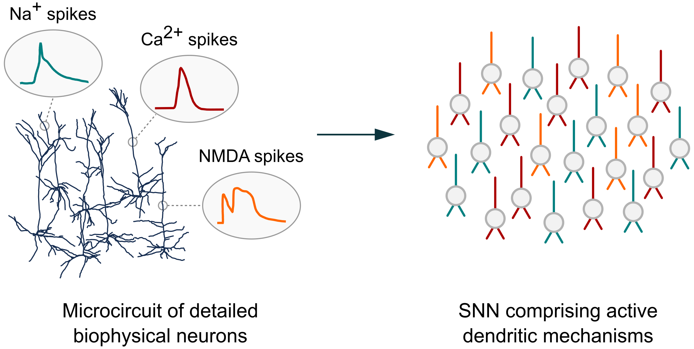

Introduction
============

.. image:: https://img.shields.io/pypi/v/Dendrify.svg
        :target: https://pypi.python.org/pypi/Dendrify

.. image:: https://readthedocs.org/projects/dendrify/badge/?version=latest
  :target: https://dendrify.readthedocs.io/en/stable/?badge=stable
  :alt: Documentation Status

.. image:: https://img.shields.io/badge/Contributor%20Covenant-v1.4%20adopted-ff69b4.svg
        :target: CODE_OF_CONDUCT.md
        :alt: Contributor Covenant

Although neuronal dendrites play a crucial role in shaping how individual 
neurons process synaptic information, their contribution to network-level 
functions has remained largely unexplored. Current spiking neural networks 
(SNNs) often oversimplify dendritic properties or overlook their essential 
functions. On the other hand, circuit models with morphologically detailed 
neuron representations are computationally intensive, making them impractical 
for simulating large networks.

In an effort to bridge this gap, we present Dendrify—a freely available,
open-source Python package that seamlessly integrates with the
`Brian 2 simulator <https://brian2.readthedocs.io/en/stable/>`_. Dendrify,
through simple commands, automatically generates reduced compartmental neuron
models with simplified yet biologically relevant dendritic and synaptic
integrative properties. These models offer a well-rounded compromise between
flexibility, performance, and biological accuracy, enabling us to investigate
the impact of dendrites on network-level functions.

.. image:: _static/intro_dark.png
   :width: 75 %
   :align: center
   :class: only-dark

.. tip::
   If you use Dendrify for your published research, we kindly ask you to cite our
   article:|br|
   **Introducing the Dendrify framework for incorporating dendrites to spiking neural networks** |br|
   M Pagkalos, S Chavlis, P Poirazi |br|
   DOI: https://doi.org/10.1038/s41467-022-35747-8 |br|

|

**CONTENTS:**

.. toctree::
   :maxdepth: 2
   :caption: Getting started
   
   self
   installation
   changelog

.. toctree::
   :maxdepth: 1
   :caption: Tutorials
   
   tutorials/Dendrify_101
   tutorials/Dendrify_simulations

.. toctree::
   :maxdepth: 1
   :caption: Examples
   
   examples/compartmental
   examples/point
   examples/synapses
   examples/validation

.. toctree::
   :maxdepth: 2
   :caption: Reference documentation

   api/models
   api/classes
   genindex

.. toctree::
   :maxdepth: 1
   :caption: Useful information

   support
   papers
   code_of_conduct

.. |br| raw:: html

      
