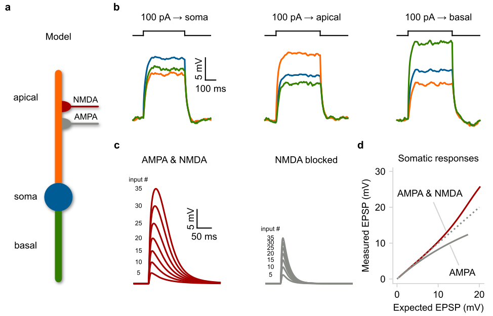
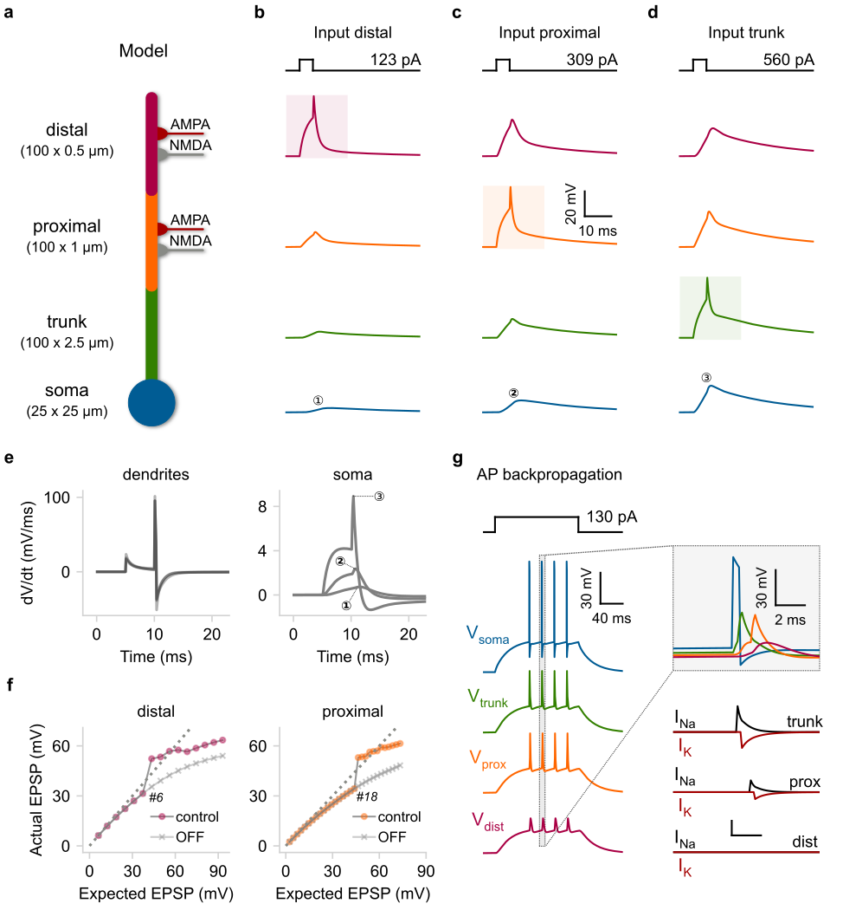

Examples
========
Bellow you will find two model examples adopted from the `Dendrify paper`_.

* :ref:`Example 1 | A basic compartmental model with passive dendrites <example 1>`
  
  In this example we show that even rudimentary models can reproduce essential
  neuronal properties such as the electrical segmentation caused by dendrites.
  This allows multiple integration sites to coexist within a neuron and dendrites
  to operate semi-autonomously from the soma, while greatly affecting neuronal output.

* :ref:`Example 2 | A reduced compartmental model capturing active dendritic properties <example 2>`
  
  In this example we show that reduced compartmental I&F models, equipped with
  event-driven dendritic spiking mechanisms can faithfully reproduce a broad range
  of dendritic properties such as:

  * Supralinear input integration
  * Dendrite-specific spiking threshold
  * Location-dependent filtering
  * Backpropagation of somatic spikes

.. tip::
   By clicking the "**Open in Colab**" button located under each example, you
   can run in your browser (without locally installing Dendrify or Brian) an
   interactive Jupyter notebook that reproduces the respective neuron models and
   simulation results.

----

.. _example 1:

**Example 1 | A basic compartmental model with passive dendrites**

**a)** Schematic illustration of a compartmental model consisting of a soma
(spiking unit) and two dendrites (passive integrators). The apical dendrite
can integrate excitatory synapses comprising AMPA and NMDA currents. **b)**
Membrane voltage responses to current injections of the same amplitude are
applied individually to each compartment. Notice the electrical segregation
caused by the resistance between the three neuronal compartments. **c** Somatic
responses to a varying number of simultaneous synaptic inputs (5–35 synapses).
*Left*: control EPSPs, *Right*: EPSPs in the presence of NMDA blockers. **d)**
Input-output function of the apical dendrite as recorded at the soma. The
dotted line represents a linear function. Notice the shift from supralinear
to the sublinear mode when NMDARs are blocked.

.. image:: https://colab.research.google.com/assets/colab-badge.svg
      :target: https://colab.research.google.com/github/Poirazi-Lab/dendrify/blob/main/paper_figures/Fig2_notebook.ipynb
      :alt: Open in Colab

----

.. _example 2:

**Example 2: A reduced compartmental model capturing active dendritic properties**

**a)** Schematic illustration of a compartmental model consisting of a soma
(leaky I&F) and three dendritic segments (trunk, proximal, distal) equipped
with Na+ VGICs. The distal and proximal segments can also receive AMPA
and NMDA synapses. **b–d)** Rheobase current injections (5 ms square pulses) for
dSpike generation were applied individually to each dendritic segment. *Shaded
areas*: location of current injection and dSpike initiation. *Top*: stimulation
protocol showing the current threshold for a single dSpike (rheobase current).
**e)** First temporal derivative of dendritic (left) and somatic (right) voltage
traces from panels (**b–d**). **f)** Input–output function of the distal (left) and
proximal (right) segment as recorded from the corresponding dendritic locations.
We also indicate the number of quasi-simultaneously activated synapses (ISI = 0.1 ms)
needed to elicit a single dSpike in each case. *OFF*: deactivation of Na+ dSpikes.
*Dashed lines*: linear input–output relationship. **g)** *Left*: Backpropagating dSpikes
are generated in response to somatic current injections. The short-amplitude
spikelets detected in the distal branch are subthreshold voltage responses for
dSpike initiation. *Right*: Magnified and superimposed voltage traces (top) from
the dashed box (left). *Bottom*: dendritic voltage-activated currents responsible
for dSpikes generation in each dendritic segment.

.. image:: https://colab.research.google.com/assets/colab-badge.svg
      :target: https://colab.research.google.com/github/Poirazi-Lab/dendrify/blob/main/paper_figures/Fig3_notebook.ipynb
      :alt: Open in Colab

.. _Dendrify paper: https://doi.org/10.1038/s41467-022-35747-8
